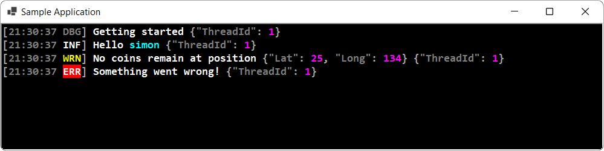

# Serilog.Sinks.RichTextBox.WinForms.Colored
[](https://www.nuget.org/packages/Serilog.Sinks.RichTextBox.WinForms.Colored)
[](https://www.nuget.org/packages/Serilog.Sinks.RichTextBox.WinForms.Colored)
[](https://opensource.org/licenses/Apache-2.0)

A [Serilog](https://serilog.net) sink that writes log events to any WinForms [RichTextBox](https://docs.microsoft.com/en-us/dotnet/desktop/winforms/controls/richtextbox-control-overview-windows-forms) control with coloring and custom theme support. 



## Getting started

Install the [Serilog.Sinks.RichTextBox.WinForms.Colored](https://www.nuget.org/packages/Serilog.Sinks.RichTextBox.WinForms.Colored) package from NuGet:

```powershell
Install-Package Serilog.Sinks.RichTextBox.WinForms.Colored
```

Declare your [RichTextBox](https://docs.microsoft.com/en-us/dotnet/desktop/winforms/controls/richtextbox-control-overview-windows-forms) control and give it a name that you can reference it from the code-behind. e.g.:

```csharp
private System.Windows.Forms.RichTextBox richTextBox1;
private void InitializeComponent()
{
    this.richTextBox1.BackColor = System.Drawing.SystemColors.Window;
    this.richTextBox1.Dock = System.Windows.Forms.DockStyle.Fill;
    this.richTextBox1.Font = new System.Drawing.Font("Consolas", 10.8F, System.Drawing.FontStyle.Bold, System.Drawing.GraphicsUnit.Point);
    this.richTextBox1.Location = new System.Drawing.Point(0, 0);
    this.richTextBox1.Name = "richTextBox1";
}
```

Then enable the sink using the following snippet:

```csharp
var options = new RichTextBoxSinkOptions(ThemePresets.Dark, 200, 5, true);
var sink = new RichTextBoxSink(richTextBox1, _options);
Log.Logger = new LoggerConfiguration()
    .MinimumLevel.Verbose()
    .WriteTo.Sink(sink, LogEventLevel.Verbose)
    .Enrich.WithThreadId()
    .CreateLogger();

Log.Information("Hello, world!");
```

Log events will be written to the `RichTextBox` control:

```
[11:54:36 INF] Hello, world!
```

### Themes

The following built-in themes are available at this time:

| Theme                               | Description
| ----------------------------------- | ----------------------------------------------------------------- |
| `ThemePresets.Dark`                 | Styled to replicate the default theme of  _Serilog.Sinks.Console_ |
| `ThemePresets.Light`                | A theme with a light background and contrasting colors.           |

### Output templates

The format of events to the RichTextBox can be modified by providing a template renderer to the sink.

```csharp
var options = new RichTextBoxSinkOptions(ThemePresets.Dark, 200, 5, true);
var renderer = new TemplateRenderer(ThemePresets.Dark, "[{Timestamp:HH:mm:ss} {Level:u3}] {Message:lj}{NewLine}{Exception}");
var sink = new RichTextBoxSink(richTextBox1, _options, renderer);
Log.Logger = new LoggerConfiguration()
    .MinimumLevel.Verbose()
    .WriteTo.Sink(sink, LogEventLevel.Verbose)
    .Enrich.WithThreadId()
    .CreateLogger();

Log.Information("Hello, world!");
```
## License

This project is licensed under the terms of the [Apache License, Version 2.0](LICENSE).
